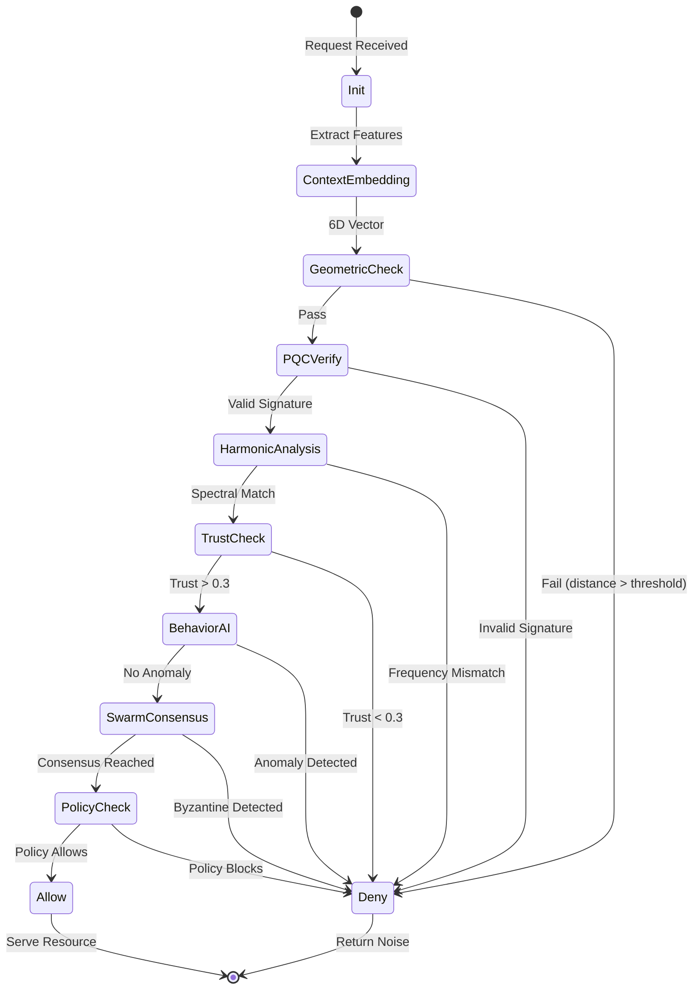

# SCBE Security Pipeline Flow Diagram

This diagram shows the complete request flow through the SCBE security layers.

## Layer Mapping

| Diagram Stage | SCBE Pipeline Layer | Function |
|---------------|---------------------|----------|
| Init | Layer 1 | Complex State Generation |
| ContextEmbedding | Layers 2-3 | Realification + Weighted Transform |
| GeometricCheck | Layers 4-5 | Poincaré Embedding + Hyperbolic Distance |
| PQCVerify | Crypto Layer | ML-KEM-768, ML-DSA-65 Verification |
| HarmonicAnalysis | Layers 9-10 | Spectral + Spin Coherence |
| TrustCheck | Layer 8 | Realm Distance Calculation |
| BehaviorAI | Layer 11 | Triadic Temporal Aggregation |
| SwarmConsensus | Fleet Layer | Multi-agent Byzantine Consensus |
| PolicyCheck | Layer 13 | Risk Decision Engine |
| Allow/Deny | Output | ALLOW / QUARANTINE / DENY |

## Decision Outcomes

- **Allow**: Request passes all checks, resource served
- **Deny**: Request fails any check, returns cryptographic noise (no information leakage)
- **Quarantine** (not shown): Borderline requests held for manual review
